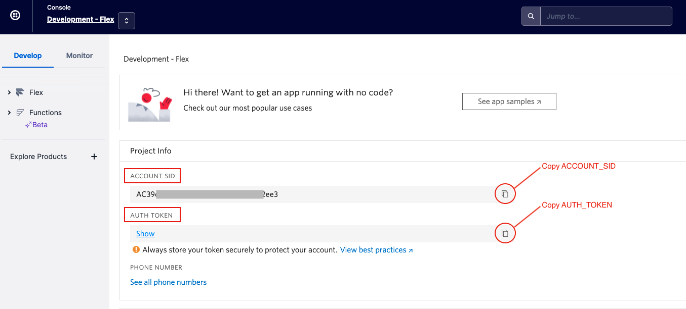
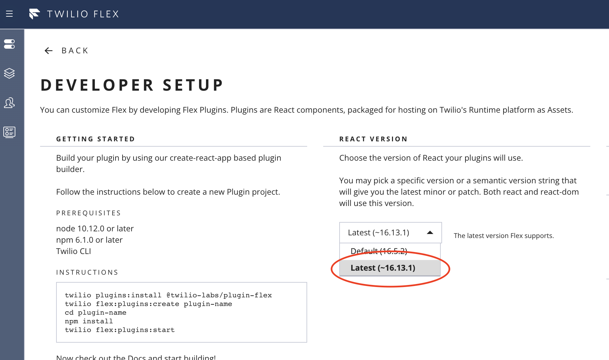
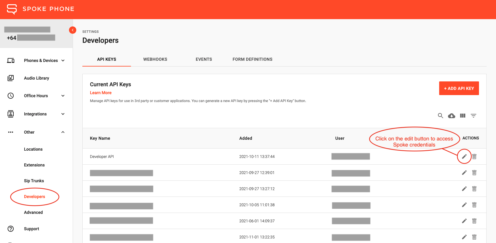
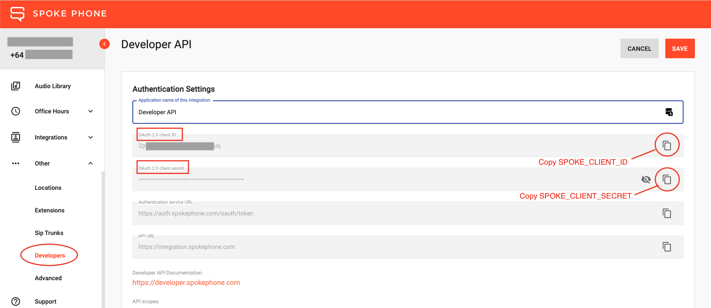
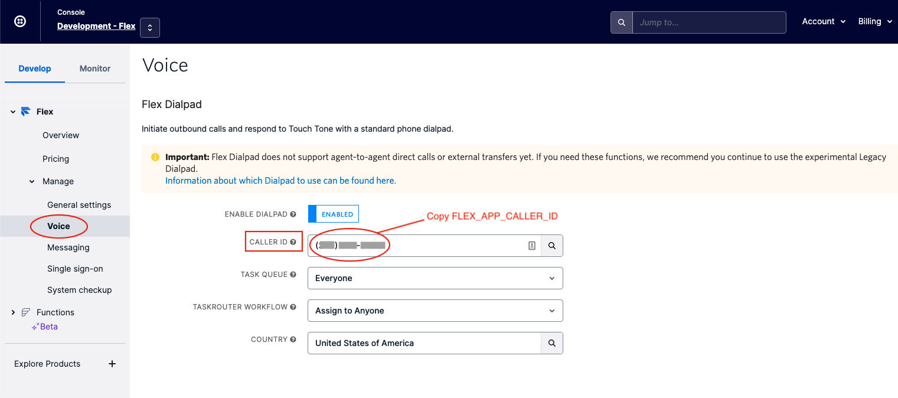

# twilio-flex-spoke-directory-plugin

Spoke Directory plugin for Twilio Flex.

## Overview

This repository is a quickstart for getting the Spoke Directory plugin on your Twilio Flex account.

The Spoke Directory plugin adds a `Spoke` tab when clicking on the call forward button from the Flex Agent call screen. This tab will show the list of entries in your Spoke directory and will allow you to transfer an incoming call to a directory contact.

## Prerequisites

1. Twilio account SID and auth token for your Twilio Flex Project.  This plugin (and the Spoke Account you create in the next step) **must** be deployed into the same project as Twilio Flex.



2. Spoke Account: Signup for a free developer account at https://account.spokephone.com/twilio. You will need your Twilio account SID and auth token to complete the signup flow
3. Spoke Developer API credentials - get these from https://account.spokephone.com/developer-api. See [Developer API Authentication](https://developer.spokephone.com/#section/Authentication) for more information
4. NodeJS 12, NPM 6 installed locally
5. Twilio Flex configured to use React 16.13.1 from the Twilio Flex Admin Panel - https://flex.twilio.com/admin/developers
5. Twilio CLI installed locally - https://www.twilio.com/docs/twilio-cli/quickstart
6. Twilio CLI Serverless plugin installed locally - https://www.twilio.com/docs/labs/serverless-toolkit/getting-started#install-the-twilio-serverless-toolkit
7. Twilio CLI Flex plugin installed locally - https://www.twilio.com/docs/flex/developer/plugins/cli/install

## Setup

1. Install Twilio CLI, Twilio's Serverless plugin and Twilio's Flex plugin

```bash
npm install twilio-cli@latest -g
twilio plugins:install @twilio-labs/plugin-serverless
twilio plugins:install @twilio-labs/plugin-flex
```

2. Ensure Twilio Flex is configured to use React 16.13.1

Open [Developer Setup on the Twilio Flex Admin Panel](https://flex.twilio.com/admin/developers) and make sure that the React version is set to `Latest (~16.13.1)`



## Deploy

### 1. Checkout and install

Checkout this codebase to your local machine, and install required NPM packages

```bash
$ git clone https://github.com/spoke-ph/twilio-flex-spoke-directory-plugin.git
$ cd twilio-flex-spoke-directory-plugin
$ npm install
```

### 2. Twilio account credentials

Setup your Twilio account credentials using the Twilio CLI

```bash
$ twilio login
$ twilio profiles:use {YOUR_ACCOUNT}
```

### 3. Configuring environment for Flex Functions

Twilio's Serverless deploy process will automatically upload any environment variables in your `.env` file to the Twilio service.
This file must be present in the `functions` directory, and can be copied over from `.env.functions.example`. Update `.env` with the following values using your favourite editor. The values for `YOUR_SPOKE_CLIENT_ID` and `YOUR_SPOKE_CLIENT_SECRET` are provided to you when you create a Developer API key in your Spoke account:  



Developer API authentication settings:



Content of `functions/.env` file:
```
# functions/.env

SPOKE_CLIENT_ID={YOUR_SPOKE_CLIENT_ID}
SPOKE_CLIENT_SECRET={YOUR_SPOKE_CLIENT_SECRET}
SPOKE_AUTH_SERVICE_URL=https://auth.spokephone.com/oauth/token
SPOKE_API_URL=https://integration.spokephone.com
ACCOUNT_SID={ACCOUNT SID}
AUTH_TOKEN={AUTH TOKEN}
```

### 4. Deploy Serverless functions

The Serverless deploy process will create a new Twilio Runtime service in your Twilio account called `twilio-flex-spoke-directory-plugin`.  The functions and environment variables in this project will be deployed into this service.

```bash
$ npm run functions:deploy
```
When deployment has finished, the Twilio Serverless URL for the application will be printed to the console. This URL can be used to access the application and will be required for the plugin deployment. Note it down:

`Deployed to: https://spoke-api-service-1234-dev.twil.io`

### 5. Configuring environment for Flex plugin

Similar to Flex Functions, Flex plugin deployment will use the content of `.env` file to upload environment variables to the Twilio plugin. This `.env` file must be located in the root folder and can be copied from `.env.plugin.example` file. Content of `.env` should look like this:
```
# .env

FLEX_APP_FUNCTIONS_BASE_URL=XXX-dev.twil.io
FLEX_APP_CALLER_ID=+131555XXXX
```
`FLEX_APP_FUNCTIONS_BASE_URL` is the plugin deployment URL that is printed out in step 4.
`FLEX_APP_CALLER_ID` can be found in your Twilio console. It can be any Phone Number or Verified Caller ID from the same Twilio project that you are deploying into.



When adding the value to `.env` file, make sure you add the country code at the front and drop all the spaces, brackets and other formatting symbols. As with all Twilio numbers this number should be in +E.164 general format and look like this: `+1315555XXXX`.

### 6. Deploy and release Flex plugin

The Flex plugin deploy process will create a new Twilio Flex plugin within your Twilio Flex account called `twilio-flex-spoke-directory`.

When deploying, the plugin version will be set as the version inside `package.json`. To avoid version conflicts, please ensure that the `package.json` version is updated accordingly for every deploy.

```bash
$ CHANGELOG="Added new functionality" npm run plugin:deploy
# Once plugin is ready for release
$ npm run plugin:release
```

Note that when a plugin version has been deployed, it will not be available for Flex Agents until the version has been released.

### 7. Check setup

To verify the functions deployment, login to your project in the Twilio console, and go to the Develop --> Functions --> Services page. Click on the `twilio-flex-spoke-directory-plugin` service, then click on `Environment Variables` near the bottom of the page. Make sure that `SPOKE_CLIENT_ID`, `SPOKE_CLIENT_SECRET`, `SPOKE_AUTH_SERVICE_URL`, `SPOKE_API_URL` are correctly set.

To verify Flex plugin deployment, go to https://flex.twilio.com/admin/plugins. You should see `twilio-flex-spoke-directory-plugin` in the list with status set to "Enabled".

### 8. Keeping up to date with the new versions of this plugin

Our recommended approach is to clone this repository and then star it on GitHub. This will allow you to receive email notifications when new releases are published, then you can pull the updates to your local machine and deploy the new version.

> While you are welcome to fork the repository to your GitHub account, we don't recommend this approach as it makes the process of receiving updates harder. Forks are generally used for creating customized versions of public repositories, however, this repository is merely a wrapper for npm modules and doesn't offer a lot of opportunities for customization.


## Local Development: Plugin

Make sure that your `.env` file contains the required environment variables - see [5. Configuring environment for Flex plugin](#5-configuring-environment-for-flex-plugin) section for detailed instructions. If you wish to connect the plugin to the local instance of functions, update `FLEX_APP_FUNCTIONS_BASE_URL` to `http://localhost:3000/`.

Then you can start a local development plugin instance by running the following command:

```bash
$ npm run plugin:start
```

## Local Development: Functions

To run locally:

First, make sure that your `./functions/.env` contains the required environment variables - see [3. Configuring environment for Flex Functions](#3-configuring-environment-for-flex-functions) section for detailed instructions. Then run the following command:

```bash
npm run functions:start
```

This will start both the functions and the plugin locally, and a local Flex Agent will be opened in your browser.
